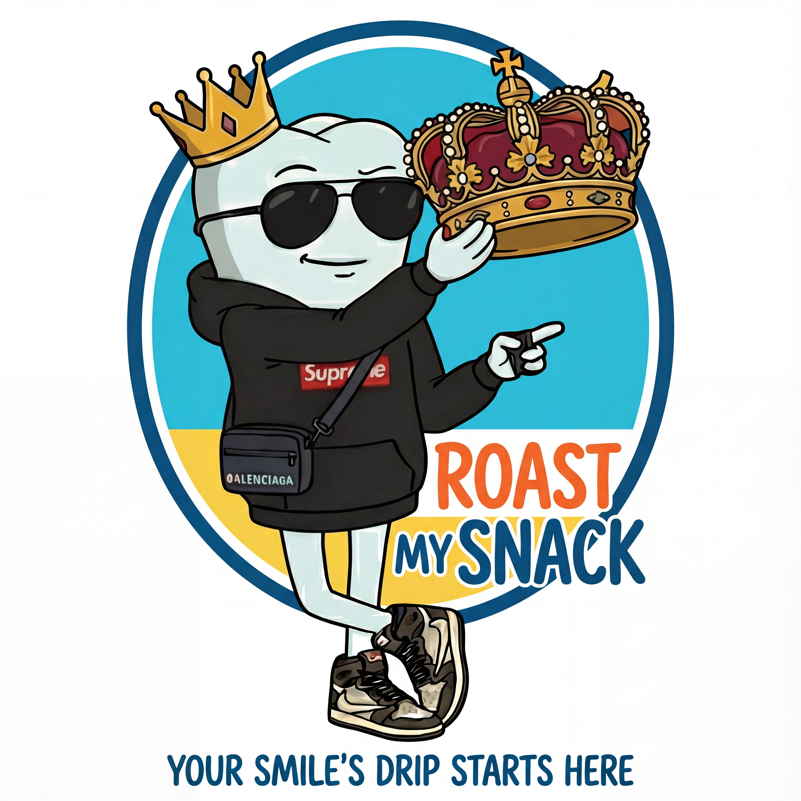
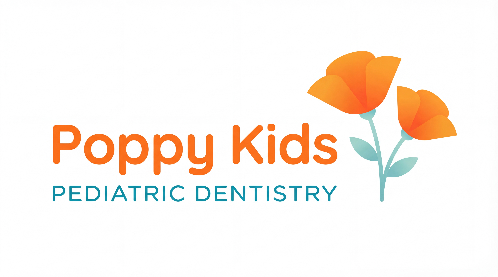
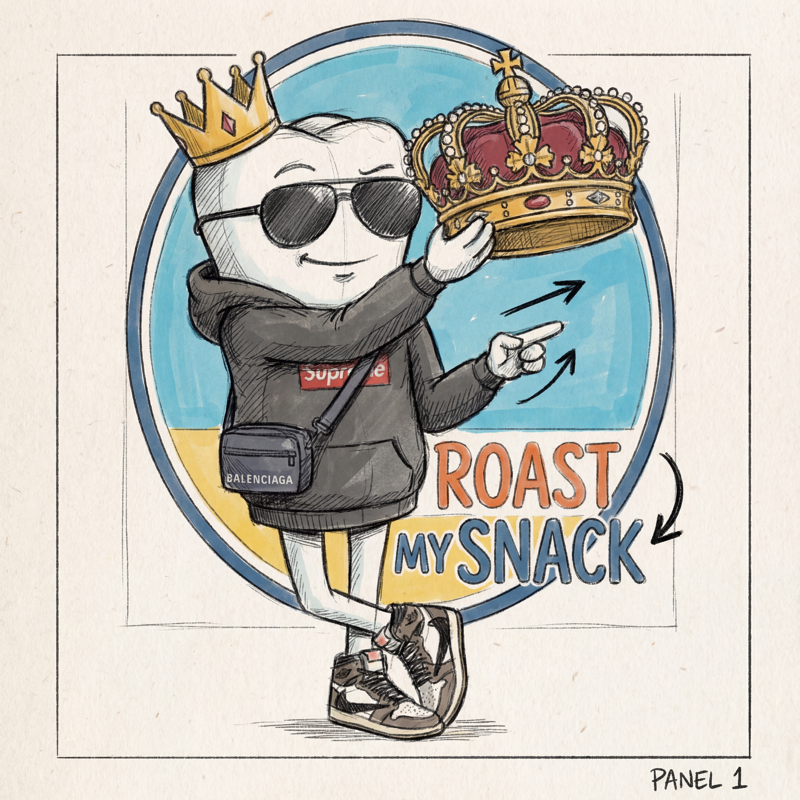

# 🔥 Roast My Snack

<p align="center">
  
</p>

> **Making dental health about the glow-up, one roast at a time.**

Roast My Snack is an AI-powered app that transforms photos of snacks into 4-panel comics where **DR. DRIP** — a molar tooth with Gen-Z energy — roasts your snack's "aesthetic threat level" to your smile. We reframe dental health as **vanity**, not lectures, because teens care more about yellow teeth than cavities.

<p align="center">
  <a href="https://www.poppykidsdental.com">
    
  </a>
  <br/>
  <em>Built in partnership with Poppy Kids Pediatric Dentistry</em>
</p>

---

## 🎨 From Concept to Reality

<table>
  <tr>
    <td align="center" width="50%">
      
      <br/>
      <em>Storyboard Concept</em>
    </td>
    <td align="center" width="50%">
      
      <br/>
      <em>Final Logo (Gemini 3 Pro Image)</em>
    </td>
  </tr>
</table>

---

## 💡 Why Vanity Works

**The Problem**: Telling a 13-year-old "sugar causes cavities" doesn't work. They don't care about cavities — they care about their **appearance**.

**Our Solution**: Reframe dental health as aesthetics:
- ❌ "Sugar rots your teeth" → Sounds like a lecture
- ✅ "That snack is gonna turn your smile yellow" → Immediate, visual, vanity-driven

**The Science**:
- 65% of teens say appearance is their top concern
- Appearance-based health messaging is 3x more effective for ages 12-17
- Peer influence on health behaviors peaks at age 14-15

**DR. DRIP** speaks their language — roasting the **snack**, never the kid. Playful destruction, not shame.

---

## ✨ Features

| Feature | Description |
|---------|-------------|
| **📸 Snap & Roast** | Upload any snack photo → get a 4-panel comic in ~30 seconds |
| **🦷 DR. DRIP Mascot** | Off-white molar in a forest green hoodie with Adult Swim energy |
| **🔥 Age-Adaptive Roasts** | Ages 9-12 "Spicy" (playful) vs 13-17 "Savage" (full destruction) |
| **📊 Transparent Scoring** | Multi-factor dental risk: sugar, acidity, stickiness, residue |
| **🔄 Taste-Matched Swaps** | Healthier alternatives that match flavor profiles |
| **🛡️ Kid-Safe Guardrails** | 50+ blocked terms, teen slang allowlist, daily audit logs |
| **📱 Social-Ready Export** | Portrait (1080×1350) and Reel (1080×1920) formats |
| **💬 5 Bubble Styles** | speech, thought, exclaim, angry, whisper — emotion-driven |

---

## 🏗️ Architecture

### Tech Stack

| Layer | Technology |
|-------|------------|
| **Backend** | Python 3.11+ with FastAPI, `uv` package manager |
| **AI Vision** | Gemini 2.5 Flash with Thinking Mode (8192 tokens) |
| **AI Writer** | Gemini 2.5 Pro with Thinking Mode (24576 tokens) |
| **AI Image** | Gemini 3 Pro Image (Nano-Banana) / Imagen 4.0 |
| **Vector DB** | Qdrant Cloud for RAG-based semantic search |
| **Frontend** | Next.js 14 + React 18 + Tailwind CSS + Framer Motion |

### System Flow

```
┌─────────────┐     ┌──────────────┐     ┌─────────────┐
│   📸 Photo   │────▶│  Gemini      │────▶│   Qdrant    │
│   Upload    │     │  Vision      │     │   Search    │
└─────────────┘     └──────────────┘     └─────────────┘
                           │                    │
                           ▼                    ▼
                    ┌──────────────┐     ┌─────────────┐
                    │  Guardrails  │◀────│   Score &   │
                    │  Service     │     │   Retrieve  │
                    └──────────────┘     └─────────────┘
                           │
                           ▼
                    ┌──────────────┐     ┌─────────────┐
                    │   Gemini     │────▶│  Nano-      │
                    │   Writer     │     │  Banana     │
                    └──────────────┘     └─────────────┘
                                               │
                                               ▼
                                        ┌─────────────┐
                                        │  🎨 Comic   │
                                        │   Output    │
                                        └─────────────┘
```

---

## 🚀 Quick Start

### Prerequisites

- Python 3.11+
- [uv](https://github.com/astral-sh/uv) package manager
- Node.js 18+
- Google Gemini API key
- Qdrant Cloud account (or local instance)

### Backend Setup

```bash
cd backend

# Create virtual environment
uv venv && source .venv/bin/activate

# Install dependencies
uv pip install -e .

# Configure environment
cp .env.example .env
# Edit .env: Add GEMINI_API_KEY, QDRANT_URL, QDRANT_API_KEY

# Seed the database (first time)
./seed_data.sh

# Run the server
./run_server.sh
# API at http://localhost:8000
# Docs at http://localhost:8000/docs
```

### Frontend Setup

```bash
cd frontend

npm install
npm run dev
# App at http://localhost:3000
```

---

## 🎭 DR. DRIP Character

<table>
  <tr>
    <td width="40%">
      <strong>Visual Design:</strong>
      <ul>
        <li>Off-white/pale cyan molar body</li>
        <li>Dark forest green pullover hoodie</li>
        <li>Black retro sunglasses on forehead</li>
        <li>Chunky beige Yeezy-style slides</li>
        <li>Large expressive eyes</li>
        <li>Root-like legs</li>
      </ul>
    </td>
    <td width="60%">
      <strong>Personality Modes:</strong>
      <table>
        <tr><th>Mode</th><th>Ages</th><th>Vibe</th></tr>
        <tr><td>🌶️ Spicy</td><td>9-12</td><td>"sus", "mid", "skill issue"</td></tr>
        <tr><td>💀 Savage</td><td>13-17</td><td>"cooked", "L + ratio", "aura"</td></tr>
      </table>
      <br/>
      <em>Adult Swim energy (Rick & Morty, Smiling Friends)</em>
    </td>
  </tr>
</table>

---

## 📊 Dental Risk Scoring

```python
risk_score = 100 × (
    0.45 × normalized(added_sugar_g_per_100g) +  # Sugar
    0.20 × acidity_factor +                       # Acid erosion
    0.20 × stickiness +                           # Stays on teeth
    0.10 × residue +                              # Film buildup
    0.05 × crunch_hardness                        # Can crack teeth
)
```

| Score | Mode | Comic Style |
|-------|------|-------------|
| < 30 | 🎉 CELEBRATE | "Glow Up Approved" — W Arc |
| ≥ 30 | 🔥 EDUCATE | Vanity roast — Roast Arc |
| No match | ❓ UNKNOWN | Generic DR. DRIP tips |

---

## 🛡️ Safety & Compliance

| Guardrail | Implementation |
|-----------|----------------|
| **Blocked Terms** | 50+ explicit profanity, slurs, violence (zero tolerance) |
| **Teen Slang Allowlist** | "cringe", "sus", "cap", "bruh", "goated", "rizz" (OK) |
| **Auto-Clean** | "damn" → "dang", "hell" → "heck" |
| **Audit Logs** | Daily JSONL with SHA256 hashes |
| **Clinic-Approved Facts** | All facts verified by dental professionals |
| **Age-Appropriate** | Content filtered by age band |

**Philosophy**: Roasts the SNACK, never the kid. Playful, not shameful.

---

## 🗄️ Data Collections (Qdrant)

All collections use 768-dimensional vectors (Gemini text-embedding-004):

| Collection | Purpose | Key Fields |
|------------|---------|------------|
| `snacks_v1` | 33+ snacks with dental risk factors | sugar, acidity, stickiness, taste_cluster |
| `facts_v1` | Clinic-approved dental facts | age_band, risk_tags, source_url |
| `swaps_v1` | Healthier alternatives | taste_cluster, allergy_tags |
| `styles_v1` | Branding templates | colors, fonts, bubble_style |

---

## 📚 API Endpoints

| Endpoint | Method | Description |
|----------|--------|-------------|
| `/api/capture/intake` | POST | Upload snack photo |
| `/api/vision/detect` | POST | Detect food items (Gemini Vision) |
| `/api/score/retrieve` | POST | Score items + fetch facts/swaps |
| `/api/script/compose` | POST | Generate 4-panel script |
| `/api/render/comic` | POST | Render comic with Nano-Banana |
| `/api/export/zip` | POST | Export with captions |

Full docs at `http://localhost:8000/docs`

---

## 🔧 Configuration

Key environment variables:

| Variable | Description | Default |
|----------|-------------|---------|
| `GEMINI_API_KEY` | Google Gemini API key | *required* |
| `QDRANT_URL` | Qdrant Cloud URL | *required* |
| `QDRANT_API_KEY` | Qdrant API key | *required* |
| `GEMINI_VISION_MODEL` | Vision model | `gemini-2.5-flash` |
| `GEMINI_WRITER_MODEL` | Script model | `gemini-2.5-pro` |
| `GEMINI_IMAGE_MODEL` | Image generation | `gemini-3-pro-image-preview` |
| `GEMINI_WRITER_THINKING_BUDGET` | Thinking tokens | `24576` |

See `backend/.env.example` for full list.

---

## 📁 Project Structure

```
roast-my-snack/
├── backend/
│   ├── app/
│   │   ├── api/              # FastAPI endpoints
│   │   ├── core/             # Configuration
│   │   ├── data/             # DR. DRIP roast corpus
│   │   ├── models/           # Pydantic schemas
│   │   └── services/         # Business logic
│   │       ├── gemini_service.py      # Vision + Writer
│   │       ├── nanobana_service.py    # Image generation
│   │       ├── guardrails_service.py  # Content safety
│   │       ├── audit_service.py       # Compliance logging
│   │       ├── qdrant_service.py      # Vector search
│   │       └── scoring_service.py     # Risk calculation
│   └── storage/
│       ├── uploads/          # Original photos
│       ├── renders/          # Generated comics
│       └── audit/            # Daily JSONL logs
├── frontend/
│   ├── src/
│   │   ├── app/              # Next.js pages
│   │   ├── components/       # React components
│   │   └── hooks/            # Custom hooks
│   └── public/images/        # Logos and assets
├── data/seeds/               # Database seeding
└── docs/                     # Presentation materials
```

---

## 📋 Roadmap

### ✅ Completed (v0.9)
- Full 6-stage pipeline (Capture → Export)
- DR. DRIP character with age-adaptive personality
- Gemini Thinking Mode for vision and writing
- Nano-Banana / Imagen 4.0 comic generation
- GuardrailsService with teen slang allowlist
- AuditService with daily compliance logs
- 5 emotion-based speech bubble styles
- Next.js frontend with localStorage persistence

### 🚧 In Progress
- Production deployment (Cloud Run / Vercel)
- Analytics integration

### 📅 Planned (v1.1)
- Animated comic shorts (≤15s video)
- User accounts with comic history
- Rate limiting
- Multi-language support

---

## 🙏 Acknowledgments

Built with:
- [Google Gemini](https://ai.google.dev/) — Vision, language, and image generation
- [Qdrant](https://qdrant.tech/) — Vector database for semantic search
- [FastAPI](https://fastapi.tiangolo.com/) — Modern Python web framework
- [Next.js](https://nextjs.org/) — React framework
- [Poppy Kids Pediatric Dentistry](https://www.poppykidsdental.com) — Clinical partner

---

<p align="center">
  <strong>Roast My Snack</strong> — Vanity as a force for good 🦷✨
</p>
